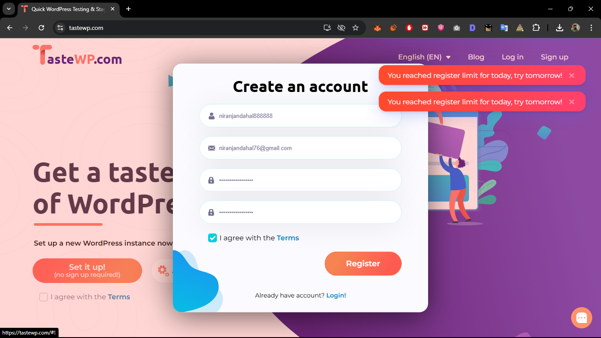

"# PHP Learning and Development Repository

This repository contains various PHP projects and learning exercises, including basic logic tests, WordPress plugin development, and debugging practices.

## 📁 Project Structure

```
php/
├── README.md
├── basicphplogictest/
│   └── phpassesment.php          # PHP fundamentals and logic exercises
├── booklibraryplugin/
│   └── booklibraryplugin.php     # WordPress custom post type plugin
├── debugging/
│   └── debuggedphpcode.php       # Debugging and error handling examples
└── research/
    └── research_about_hooks_in_wordpress.pdf
```

## 🚀 Projects Overview

### 1. Basic PHP Logic Test (`basicphplogictest/`)

**File:** `phpassesment.php`

A comprehensive collection of fundamental PHP programming exercises covering:

- **String Manipulation**: String reversal implementation using loops
- **Array Operations**: Filtering even numbers from arrays
- **PHP Comparison Operators**: Demonstration of `==` vs `===` differences
- **Recursive Functions**: Factorial calculation using recursion
- **Array Processing**: Finding maximum values in arrays

**Key Learning Points:**
- Understanding PHP data types and type coercion
- Implementing algorithmic solutions in PHP
- Working with arrays and loops
- Recursive function design

**To Run:**
```bash
php basicphplogictest/phpassesment.php
```

### 2. Book Library WordPress Plugin (`booklibraryplugin/`)

**File:** `booklibraryplugin.php`


<!-- i want to add one screenshot image here -->



I encountered an issue while trying to register on "tastewp.com" and instawp was asking for card for billing information so i was unable to test the plugin on a live server.


**Features:**
- Custom post type "Book" registration
- Meta fields for Author Name and Published Year
- Admin interface with custom meta boxes
- Custom columns in the WordPress admin list view
- Security implementations with nonces and data sanitization


### 3. PHP Debugging Examples (`debugging/`)

**File:** `debuggedphpcode.php`

Demonstrates proper error handling and validation techniques in PHP.

**Features:**
- Input validation for numeric ranges
- Grade calculation system with proper error handling
- Array key existence checking
- Comprehensive error messaging
- Student grade management system

**Validation Rules:**
- Marks must be numeric
- Marks must be between 0-100
- Handles missing data gracefully
- Provides meaningful error messages

**Grading Scale:**
- A: 90-100
- B: 80-89
- C: 70-79
- D: 60-69
- F: Below 60

## 🛠️ Requirements

- PHP 7.4 or higher
- For WordPress plugin: WordPress 5.0+ with admin access


## 🤝 Contributing

Feel free to contribute to this learning repository by:
- Adding more PHP examples
- Improving existing code
- Adding documentation
- Suggesting new learning exercises

## 📝 License

This project is for educational purposes. Feel free to use and modify the code for learning.

---

**Author**: Niranjan Dahal  
**Purpose**: PHP Learning and WordPress Development Practice" 
